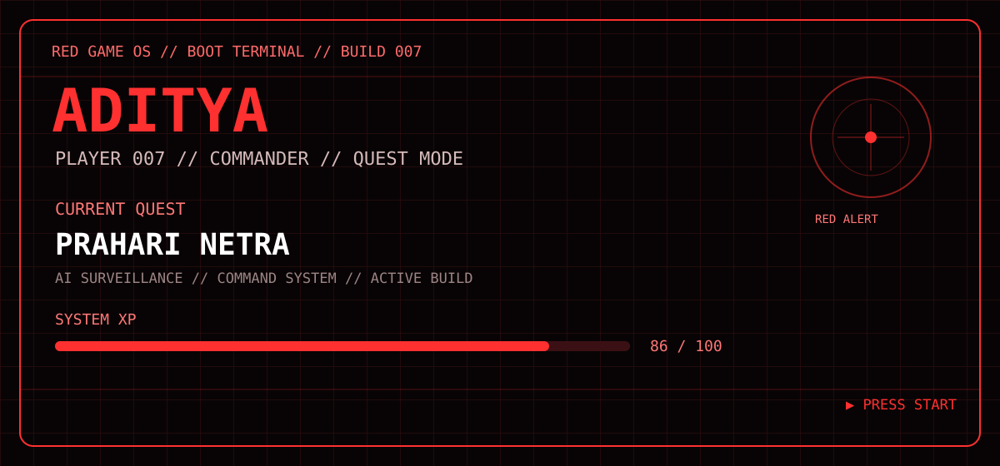

# 🔴 ADITYA // RED GAME OS

<p align="center">
  
</p>

<p align="center"><b>PLAYER 007</b> · <b>RED ALERT MODE</b> · <b>SYSTEM ONLINE</b></p>

<p align="center">
<a href="https://github.com/Adityatyagi077/prahari-netra">⚔️ MAIN QUEST</a> ·
<a href="https://github.com/Adityatyagi077/Game007">🎮 GAME ZONE</a> ·
<a href="https://github.com/Adityatyagi077">🛰️ PLAYER PROFILE</a>
</p>

---

## 🔴 COMMAND HUD

| MODULE | STATUS |
|---|---|
| PLAYER | `ADITYA // 007` |
| MODE | `RED ALERT / QUEST` |
| SYSTEM | `ONLINE` |
| XP | `86 / 100` |
| CURRENT ZONE | `ENGINEERING LAB` |
| MAIN QUEST | `PRAHARI NETRA` |

> **MISSION:** Build systems. Solve problems. Ship projects. Level up.

---

## 🎮 GAME MODE

### `JUMP // SURVIVAL PROTOCOL`

**Objective:** Jump over incoming blocks and survive as long as possible.

**Controls:** `SPACE` / `↑` / `W` to jump · `P` to pause · `R` to restart

**Difficulty:** `NORMAL`

**Scoring:** +1 for every obstacle cleared.

> The mini-game is the local `jump.html` in this repository. Open it directly from the repo files to play.

---

## ⚔️ QUEST SELECT

### `01 // PRAHARI NETRA`
**STATUS:** `ACTIVE`

AI-powered tactical surveillance and command platform.

`MAP` `CAMERAS` `AI VISION` `EVIDENCE` `HEALTH` `AUDIT`

**REWARD:** `AI + FULL-STACK + SYSTEM DESIGN XP`

[ ENTER QUEST →](https://github.com/Adityatyagi077/prahari-netra)

### `02 // TRAVEL JARVIS`
**STATUS:** `IN DEVELOPMENT`

AI travel assistant for conversational planning and travel intelligence.

### `03 // GAME007`
**STATUS:** `GAME ZONE ONLINE`

The experimental zone for the Game OS interface and mini-games.

[ ENTER GAME ZONE →](https://github.com/Adityatyagi077/Game007)

---

## 🌳 SKILL TREE

```text
PLAYER 007
│
├── ⚔ ENGINEERING
│   ├── React
│   ├── TypeScript
│   ├── Node.js
│   └── APIs / Databases
│
├── 🧠 AI SYSTEMS
│   ├── Computer Vision
│   ├── YOLO
│   └── AI Applications
│
├── 🐧 SYSTEMS
│   ├── Linux
│   ├── Git
│   └── GitHub
│
└── ⌨️ CORE
    └── C++
```

---

## 🎒 INVENTORY

`🔴 RED CORE` `⚔️ PRAHARI NETRA` `🤖 TRAVEL JARVIS` `🎮 JUMP PROTOCOL` `🐧 LINUX` `🧠 AI/ML` `⚛️ REACT` `🟦 TYPESCRIPT` `⌨️ C++`

---

## 🏆 ACHIEVEMENTS

- `◆ FIRST SHIP` — Project shipped
- `◆ SYSTEM BUILDER` — Frontend + backend + AI connected
- `◆ AI VISION` — Computer-vision workflow integrated
- `◆ LINUX RUNNER` — Building from Linux
- `◆ QUEST MODE` — Project + placement grind
- `◆ RED ALERT` — Game OS v3 unlocked

---

## 📡 PLAYER STATS

<p align="center">

</p>

<p align="center">

</p>

---

## 🛰️ COMMAND TERMINAL

```text
> booting RED GAME OS...
> loading PLAYER 007...
> quest database loaded
> game engine loaded
> tactical interface online
> no shortcuts detected
> BUILD // BREAK // LEARN // SHIP
```

<p align="center"><b>████ PRESS START // ENTER THE RED ZONE ████</b></p>
