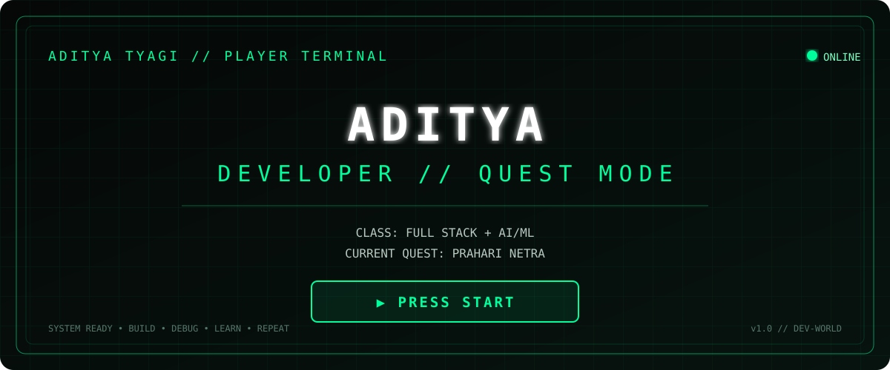

<div align="center">



# 🎮 `PLAYER PROFILE // ADITYA TYAGI`

`STATUS: ONLINE` • `CLASS: FULL STACK + AI/ML` • `MODE: BUILD`

<a href="https://github.com/Adityatyagi077/prahari-netra">

</a>

</div>

---

## 🕹️ PLAYER TERMINAL

```text
╔══════════════════════════════════════════════════════════════╗
║                     PLAYER PROFILE                          ║
╠══════════════════════════════════════════════════════════════╣
║                                                              ║
║  PLAYER        : ADITYA TYAGI                               ║
║  CLASS         : FULL STACK / AI ENGINEER                   ║
║  SPECIALITY    : COMPUTER VISION                            ║
║  CURRENT QUEST : PRAHARI NETRA                              ║
║  STATUS        : BUILDING                                   ║
║                                                              ║
║  PRIMARY SKILLS                                               ║
║  ├── C++                                                     ║
║  ├── Python                                                  ║
║  ├── TypeScript                                              ║
║  ├── React                                                   ║
║  └── AI / Computer Vision                                   ║
║                                                              ║
╚══════════════════════════════════════════════════════════════╝
```

## 🎯 MAIN QUEST

### 🛡️ PRAHARI NETRA

**AI-Powered Tactical Surveillance & Command Platform**

```text
QUEST STATUS
━━━━━━━━━━━━━━━━━━━━━━━━━━━━━━━━━━━━━━━━━━━━━━

[████████████████████████████░░░░] ACTIVE

[x] Command Center
[x] Authentication
[x] Interactive Operations Map
[x] Camera Monitoring
[x] Phone Live
[x] AI / ML Service
[x] Target Analysis
[x] Evidence Workflow
[x] System Monitoring
[ ] Production Deployment
```

**[ ▶ ENTER QUEST ](https://github.com/Adityatyagi077/prahari-netra)**

---

## 🌳 SKILL TREE

```text
                         ┌──────────────┐
                         │   ENGINEER   │
                         └──────┬───────┘
                                │
             ┌──────────────────┼──────────────────┐
             ▼                  ▼                  ▼
          🧩 DSA              🧠 AI/ML           ⚡ WEB
             │                  │                  │
        C++ / STL           Python / YOLO    React / TS / Node
             │                  │                  │
             └──────────────────┼──────────────────┘
                                ▼
                         🚀 REAL PROJECTS
```

## 🎒 INVENTORY

`C++` `Python` `TypeScript` `JavaScript` `React` `Vite` `Node.js` `YOLO` `Computer Vision` `OpenAPI` `Drizzle` `Linux` `Git`

## 🏆 ACHIEVEMENTS

```text
[🏆] REAL SYSTEM BUILDER     Multi-service application
[🧠] AI EXPLORER             Computer vision integration
[🗺️] SYSTEM ARCHITECT        Operational command interface
[💻] FULL STACK QUEST        Frontend + Backend + ML
[🐧] LINUX WARRIOR           Linux development workflow
[🔥] DAILY GRIND              Continuous DSA + engineering
```

## 📟 TERMINAL LOG

```text
> booting developer.exe
[OK] C++ module loaded
[OK] Python module loaded
[OK] React module loaded
[OK] TypeScript module loaded
[OK] AI module loaded

> loading current quest...
[OK] PRAHARI NETRA
[OK] FRONTEND
[OK] BACKEND
[OK] ML SERVICE

> SYSTEM READY

aditya@dev:~$ _
```

## 🎮 GAME RULES

> **BUILD → BREAK → DEBUG → LEARN → REPEAT**

`XP > COMFORT`  
`CURIOSITY > EGO`  
`BUILDING > TALKING`

---

<div align="center">

### `> GAME NEVER ENDS.`

</div>
