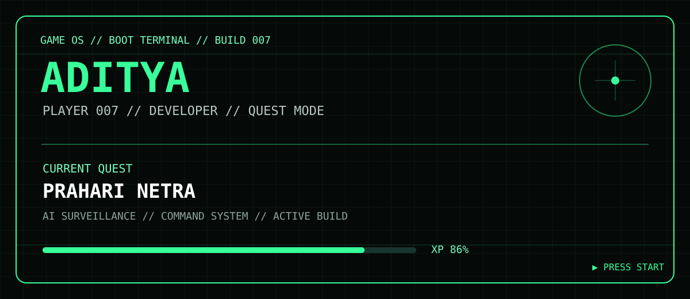

# 🎮 ADITYA // GAME OS

<p align="center"></p>

<p align="center"><b>PLAYER 007</b> · <b>QUEST MODE</b> · <b>SYSTEM ONLINE</b></p>

<p align="center">
<a href="https://github.com/Adityatyagi077/prahari-netra">⚔️ PRAHARI NETRA</a> ·
<a href="https://github.com/Adityatyagi077/Game007">🎮 GAME007</a> ·
<a href="https://github.com/Adityatyagi077">🛰️ PROFILE</a>
</p>

---

## ◈ PLAYER HUD

| SYSTEM | STATUS |
|---|---|
| 🧑‍🚀 Player | **Aditya Tyagi** |
| 🎮 Mode | **Builder / Quest Mode** |
| ⚡ Core | **AI · Full Stack · Systems** |
| 🟢 Status | **ONLINE** |
| 🗺️ Current Zone | **Engineering Lab** |

> **Objective:** Build ambitious software, learn the systems behind it, and ship working missions.

---

## ⚔️ QUEST BOARD

### `MAIN QUEST // PRAHARI NETRA`

**AI-powered tactical surveillance & command platform**

**MISSION STATUS** `██████████████████░░` **90%**

- 🗺️ Operations command map
- 📹 Multi-camera surveillance
- 🤖 YOLO-powered AI analysis
- 🧾 Evidence / incident workflow
- 🩺 System health & readiness
- 🔐 Access and audit controls

**Reward:** `SYSTEM DESIGN + AI + FULL-STACK XP`

[ ENTER QUEST →](https://github.com/Adityatyagi077/prahari-netra)

### `SIDE QUEST // TRAVEL JARVIS`

**AI travel assistant** — conversational planning, recommendations and travel intelligence.

**STATUS:** `IN DEVELOPMENT`

---

## 🌳 SKILL TREE

```text
                         ┌─ AI / ML
                         │   ├─ Computer Vision
                         │   └─ YOLO
                         │
PLAYER ──┬─ ENGINEERING ┼─ FULL STACK
         │              │   ├─ React
         │              │   ├─ TypeScript
         │              │   └─ Node.js
         │              │
         ├─ SYSTEMS     ─── APIs / Databases
         │
         └─ TOOLS       ─── Git / GitHub / Linux
```

---

## 🎒 INVENTORY

`⚔️ PRAHARI NETRA` · `🤖 TRAVEL JARVIS` · `🐧 LINUX` · `⌨️ C++` · `🧠 AI/ML` · `⚛️ REACT` · `🟦 TYPESCRIPT`

---

## 🏆 ACHIEVEMENTS UNLOCKED

- `◆ FIRST SHIP` — Built and shipped a full project
- `◆ SYSTEM BUILDER` — Connected frontend, backend and AI services
- `◆ AI VISION` — Integrated computer-vision workflow
- `◆ LINUX RUNNER` — Building and deploying from Linux
- `◆ QUEST MODE` — Consistent project + placement grind

---

## 📡 GITHUB ACTIVITY

<p align="center">

</p>

<p align="center">

</p>

---

## 🛰️ COMMAND LINKS

```text
[01] PROFILE     → github.com/Adityatyagi077
[02] MAIN QUEST  → github.com/Adityatyagi077/prahari-netra
[03] GAME OS     → github.com/Adityatyagi077/Game007
```

---

## `SYSTEM MESSAGE`

```text
> Boot sequence complete.
> Player identity loaded.
> Quest engine online.
> No shortcuts detected.
> Build. Break. Learn. Ship.
```

<p align="center"><b>PRESS START // BUILD THE NEXT LEVEL</b></p>
